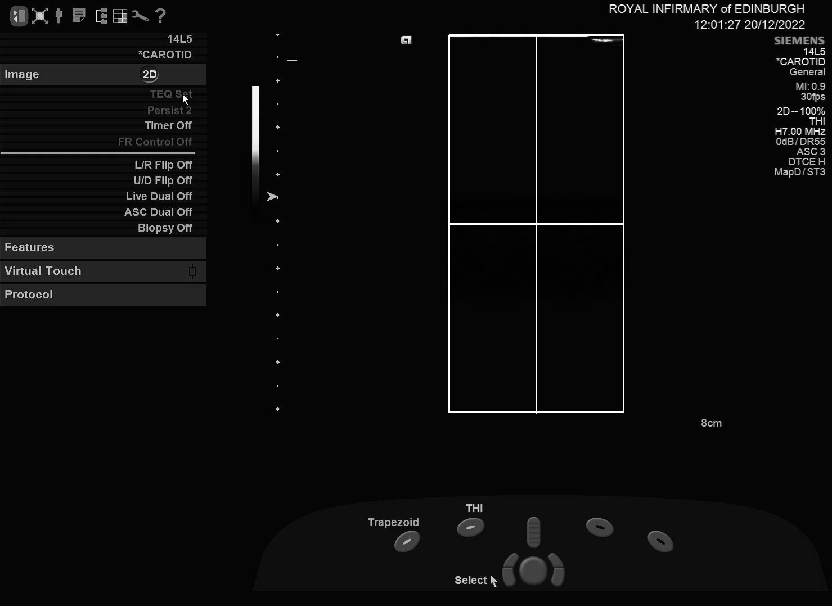
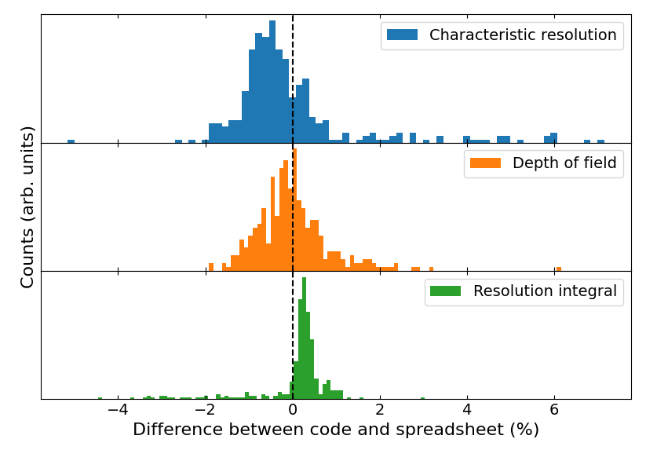
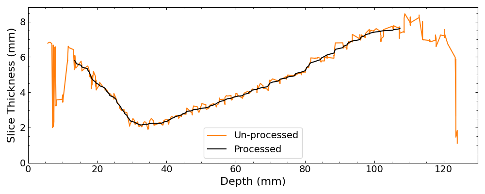

## Python methods associated with MPhys project titled "Investigating the Effect of Slice Thickness on Ultrasound Imaging Performance"

### The final report is given in thesis.pdf and the abstract is as follows:

*The effect of slice thickness on ultrasound image quality is not well quantified. The resolution integral is an established technique for calculating a single figure-of-merit that combines imaging performance over an entire ultrasound beam. Using a commercial slice thickness phantom, continuous slice thickness versus depth profiles were recorded for 10 transducers and the resolution integral was adapted to quantify imaging performance solely in the elevation plane. Slice thickness was identified as having a significant impact on ultrasound imaging performance but no clear relationship was found between the calculated resolution integrals, likely due to confounding factors from the lateral plane. There was a strong linear relationship between the sizes of the overall and elevational focal regions, while the typical resolutions were correlated but also affected by confounding factors.*

### Description of files

* `analysed/` contains all the data generated for this project. Only the final version of such data, in `analysed/gen3` was used to make graphs or draw conclusions. This folder is mostly made up of slice thickness data extracted from scan videos, but there are also several files containing more processed data such as resolution integrals from each probe type and calculated uncertainties.
* `nice_results/` contains images for this readme.
* `other_data/` contains EPP resolution integrals for many probes obtained previously by Carmel and Scott which I used to test how well this code calculates resolution integrals.
* `sample/` contains all the Python scripts for doing various calculations, including resolution integrals, getting slice thickness data from videos, and plotting graphs. Explanations of how to use the most useful functions are given below.
* `tests/` contains a few test functions for ensuring the scripts give the same results if any changes are made, as well as the files needed to check the outputs.


Description of code in `sample/`:
* `resolution_integral.py` calculates the resolution integral from measurements made with an ultrasound machine and Edinburgh Pipe Phantom (EPP).
* `correlations.py` looks for correlations between any two variables (e.g. frequency and characteristic resolution).
* `multiplot.py` functions for plotting slice thickness profiles together.
* `roi.py` used to find the coordinates of the Region of Interest for each ultrasound video and crop out the rest.
* `Rs_plot.py` used to plot characteristic resolution versus depth of field for all transducers studied here as well as those from other studies.
* `slice_thickness.py` finds the slice thickness versus depth from a video.
* `ST_uncertainties.py` calculate the uncertainty in slice thickness values.
* `utils` function for loading data.
* `videos.py` called by `slice_thickness.py` to analyse the videos.


### To calculate the resolution integral from a set of lengths and diameters

```
from resolution_integral import calc_R`
char_res, depth_field, R = calc_R(lengths, inverse_diameters)
```

### To extract slice thickness data from a video you'll need the path to the folder where the videos are stored and the name of the video to analyse - usually a number.

```
from videos import Video
viddata = {"filepath": "/path/to/video/parent/folder", "filenumber": "video number"}
```


You'll also need to put some information about the video into a file called "details.txt" which is located in the same folder as the video itself (an example file is given in this folder). It contains the video number, probe type, total scan depth shown on screen, probe frequency, focal point depths, and the Region Of Interest (ROI) of the ultrasound screen which should be used by the code - only the part of the screen showing the ultrasound signal should be included.


To obtain the ROI for a video, use:

```
from sample.roi import get_ROI
get_ROI("/path/to/video/")
```

select the region to use as in the image below, press spacebar, and the ROI numbers will be printed to the terminal.



Once you have all these details you are ready to analyse a video. Use the following code with resolution set to something like 5 (meaning analyse every 5th frame in the video).

```
vid = Video(viddata)

vid.save_slice_thickness_data(
    resolution, /path/to/output.txt"
)
```

This will save the slice thickness data to a text file in the format width, depth, height. The width is the slice thickness at that depth, and the height is the peak pixel value.

To calculate a resolution integral from this data, first create a set of theoretical EPP pipe diameters over which to test whether the scanner can visualise the pipes in the slice thickness dimension:

```
inv_diameters = np.linspace(0.01, 1.7, 400)
pipe_diameters = 1 / inv_diameters
```

I make them as inverse diameters first so that they are evenly spaced in inverse diameter space which makes the L-alpha plots look nicer. Then, find the distances over which the scanner could in theory visualise the pipes. I gave this function 4 video paths, two from the scanner with settings optimised for shallow visualisation, and two for deep, but it should work with less/more videos too:

```
L_dict, lengths, diameters = extract_Ls(required_video_paths, pipe_diameters, threshold, smoothing_factor)
```

Threshold tells the function to exclude any signals lower than a given pixel value, I chose 20. Smoothing factor determines how much to smooth the resultant lengths vs diameters plot as in Figure 2.

Then, use the ouputted visualisation lengths and pipe diameters to calculate the resolution integral as before:

```
inverse_diameters = 1 / diameters

lengths = np.array(lengths)

calc_R(lengths, inverse_diameters, show=False)
```



Figure 1. These histograms show the performance of the code in resolution_integral.py versus an NHS spreadsheet for calculating the resolution integral from Edinburgh Pipe Phantom measurements. The code is much faster and still has high accuracy in most cases.


Figure 2. Example of a slice thickness depth profile extracted from a video, also shows the smoothing and trimming process applied to make the data useable.